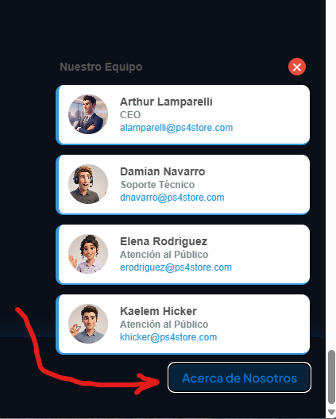
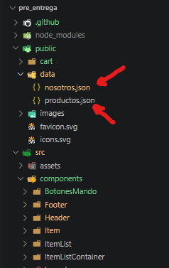
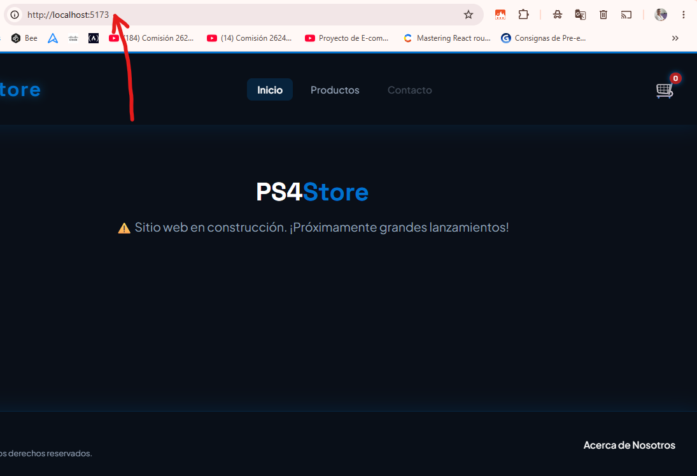
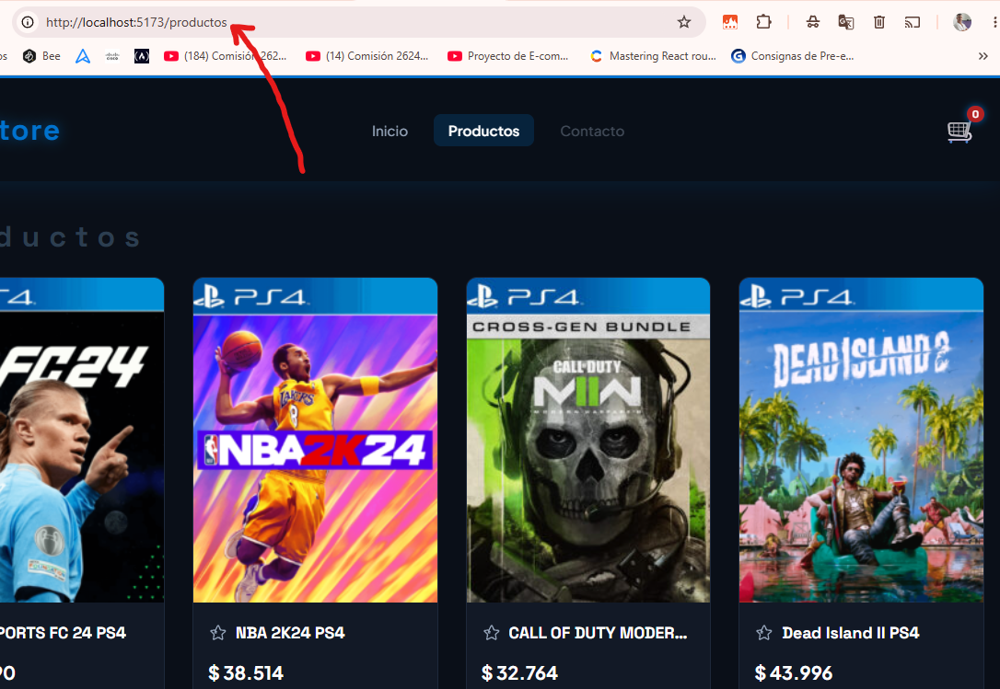
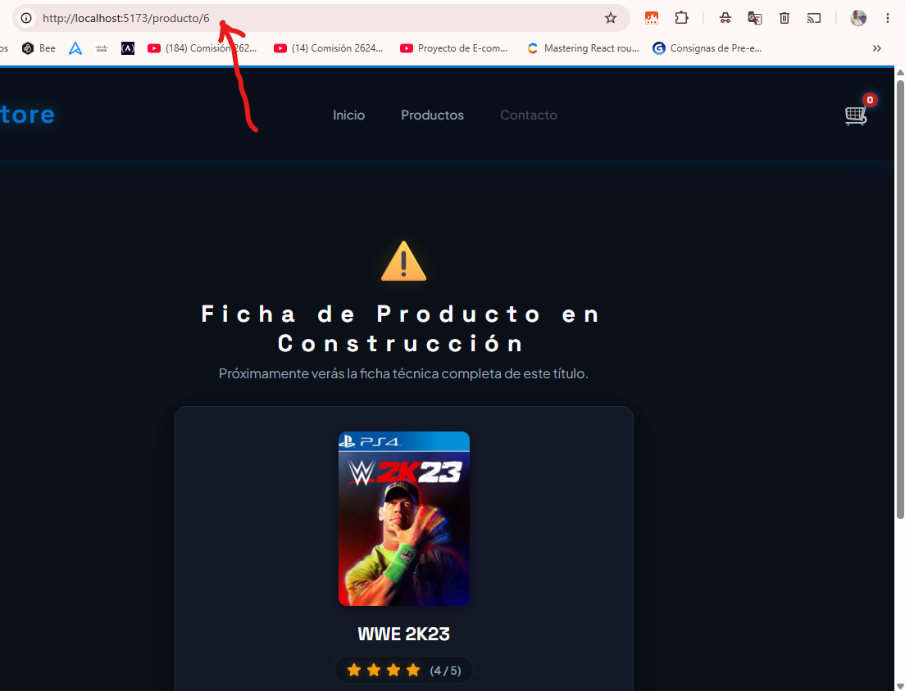
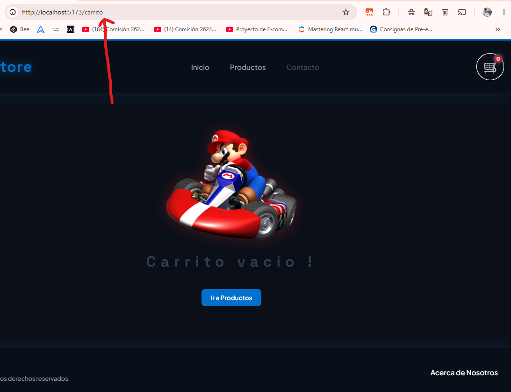
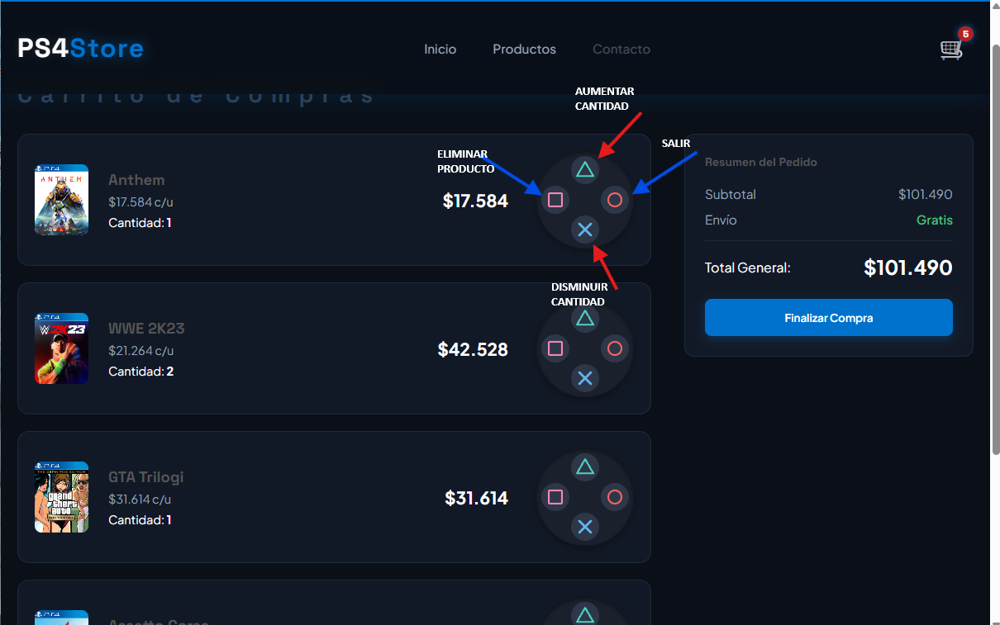

## **PROYECTO TALENTO TECH E-COMMERCE CON REACT**

### **Consignas Cumplidas:**

**Requerimiento #1: Estructura y Layout**

- El proyecto debe tener una estructura de carpetas organizada ✅

- Debe contar con un componente Layout.jsx que contenga un Header.jsx , un nav y un Footer.jsx, con una apariencia consistente y funcional ✅

- El footer tiene que tener información de la empresa y las tarjetas de al menos 3 personas. ✅

**Requerimiento #2: Catálogo de productos con datos de una API**

- La aplicación debe tener un componente como ItemListContainer.jsx (o una página que cumpla esa función) que cargue la información de productos desde un archivo productos.json local usando useEffect y fetch. ✅

- Los productos deben renderizarse utilizando un componente reutilizable Item.jsx, que reciba los datos por props. ✅

**Requerimiento #3: Sistema de ruteo**

- La navegación debe ser gestionada por react-router-dom. ✅

- Deben existir, como mínimo, las siguientes rutas:

##### **` /:` Vista principal o de bienvenida.** ✅

#####  **`/productos:`** ✅

#####  **`/producto/:id` Vista de detalle de un único producto** ✅

##### **`/carrito:` Vista del carrito de compras.** ✅

- El NavBar debe utilizar el componente  `<Link>` para una navegación fluida sin recargas de página. ✅

**Requerimiento #4: Funcionalidad del carrito con Context API**

- Debe existir un componente que gestione el estado global del carrito ✅

- Desde la vista de detalle el usuario debe poder agregar productos al carrito. Esta acción debe llamar a la función addToCart del contexto. ✅

- El NavBar debe mostrar un ícono de carrito con un indicador numérico (CartWidget) que muestre la cantidad total de productos en el carrito. Este número debe obtenerse del CartContext y actualizarse en tiempo real. ✅

- La ruta /carrito debe mostrar el detalle de los productos agregados, consumiendo la información directamente del CartContext. ✅

**Requerimiento #5: Alojamiento online**

- La página debe estar subida a Netlify o Vercel y compartir la url, junto con el link al repositorio de GitHub. ✅
